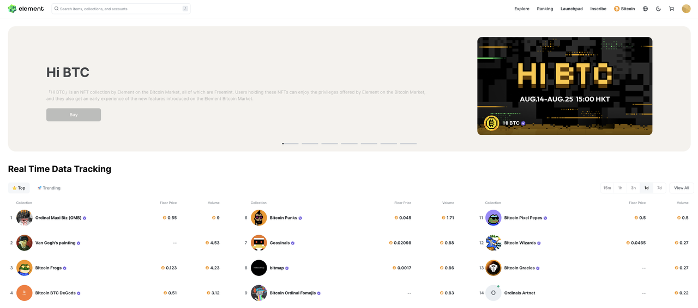

Element Market，首个社区驱动的聚合市场。为用户提供高流动性、最低的交易费、强大的交易工具和即时的数据服务。
Element Bitcoin Marketplace 于2023年7月正式上线。它拥有丰富的功能，包括超过3000个NFT合集、批量操作、铭刻、域名合集属性分类筛选等。

## 主要功能

1. 批量购买：
2. 批量上架： 
3. 批量转移：
4. 真正实时的Launchpad：
5. 首次购买无需用户提前兑换小额utxo：
6. 域名合集属性分类筛选 ：
7. 铭刻：
8. BTC与EVM钱包地址绑定：
9. 实时交易排行榜：
10. 支持3000+BTC合集：

## Trading Now
Element Bitcoin 市场致力于为用户提供全方位、多功能的数字资产交易平台，满足您在NFT领域的各种需求。

[立即来Element市场交易](https://element.market/btc)

## 联系我们
[Twitter](https://twitter.com/Element_Market)

[Discord](https://discord.com/invite/elementmarket)

[Medium](https://element-market.medium.com/)